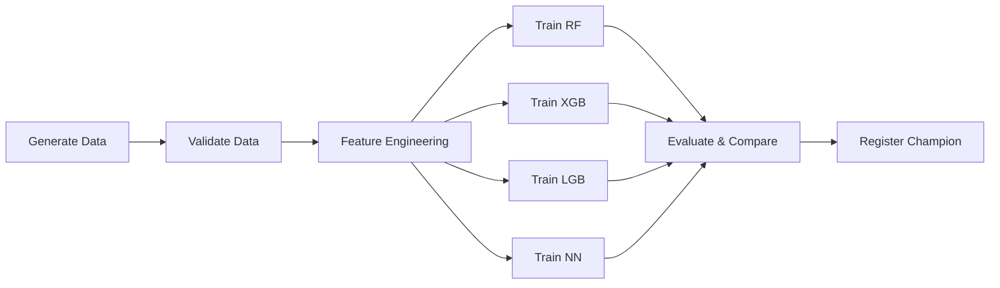

# Lab 4: Manufacturing Defect Detection — Airflow + MLflow Pipeline


## Overview

This project builds a complete MLOps pipeline using **Apache Airflow** for orchestration and **MLflow** for experiment tracking. The pipeline predicts CNC machining quality (Good / Minor Defect / Major Defect) from 6 sensor features using 4 competing ML models trained in parallel.

### Lab 3 vs Lab 4 Comparison

| Aspect | Lab 3 | Lab 4 |
|---|---|---|
| **Orchestration** | Docker Compose `depends_on` | Apache Airflow DAG |
| **Models** | 1 (RandomForest) | 4 (RF, XGBoost, LightGBM, Neural Net) |
| **Experiment Tracking** | None | MLflow (params, metrics, artifacts) |
| **Model Selection** | Manual | Automated (best F1 score) |
| **Model Registry** | None | MLflow Model Registry |

## Architecture

```
┌─────────────────────────────────────────────────────────────┐
│                      Docker Compose                         │
│                                                             │
│  ┌────────────┐    ┌─────────────┐    ┌──────────────┐      │
│  │  Airflow   │    │   MLflow    │    │  PostgreSQL  │      │
│  │ Webserver  │    │   Server    │    │ (Metastore)  │      │
│  └─────┬──────┘    └──────┬──────┘    └──────┬───────┘      │
│        │                  │                  │              │
│        └────────┬─────────┴────────┬─────────┘              │
│                 │                  │                        │
│        ┌────────▼────────┐    ┌────▼────┐                   │
│        │   Airflow DAG   │    │ SQLite  │                   │
│        └────────┬────────┘    └─────────┘                   │
│                 │                                           │
│    ┌────────────┴────────────┐                              │
│    │ 1. Generate Data        │                              │
│    │ 2. Validate Data        │                              │
│    │ 3. Feature Engineering  │                              │
│    │ 4. Parallel Training    │                              │
│    │    (RF, XGB, LGB, NN)   │                              │
│    │ 5. Evaluate & Compare   │                              │
│    │ 6. Register Champion    │                              │
│    └─────────────────────────┘                              │
└─────────────────────────────────────────────────────────────┘
```

## DAG Structure



## Sensor Features

| Feature | Unit | Range | Description |
|---|---|---|---|
| Spindle Speed | RPM | 800–3200 | Rotational speed |
| Feed Rate | mm/min | 50–400 | Travel speed |
| Depth of Cut | mm | 0.5–4.0 | Cutting depth |
| Vibration | mm/s² | 0.1–8.0 | Vibration amplitude |
| Temperature | °C | 150–350 | Tool temperature |
| Tool Wear | Index | 0.0–1.0 | Standardized wear index |

## Quality Classes

- **Good**: Optimal conditions
- **Minor Defect**: Surface finish issues
- **Major Defect**: Dimensional failure

## Quick Start

1. **Start the environment**:
   ```bash
   cd "Lab 4"
   docker compose up --build -d
   ```
2. **Access URLs**:
   - **Airflow**: http://localhost:8080 (airflow / airflow)
   - **MLflow**: http://localhost:5001
3. **Trigger Pipeline**:
   - In Airflow UI, find `manufacturing_defect_detection`
   - Toggle ON and click Trigger DAG.
4. **Compare Models**:
   - Open MLflow UI to see parameters, metrics, and artifacts.
5. **Tear down**:
   - `docker compose down -v`

## Project Structure

```
Lab 4/
├── docker-compose.yml
├── Dockerfile
├── requirements.txt
├── README.md
├── HOWTO
├── .dockerignore
├── dags/
│   └── manufacturing_dag.py
└── src/
    ├── utils.py
    ├── data_generator.py
    ├── data_validator.py
    ├── feature_engineering.py
    ├── model_trainer.py
    └── model_evaluator.py
```

## Authors
**Ajith Srikanth** - IE7374 MLOps - Northeastern University
