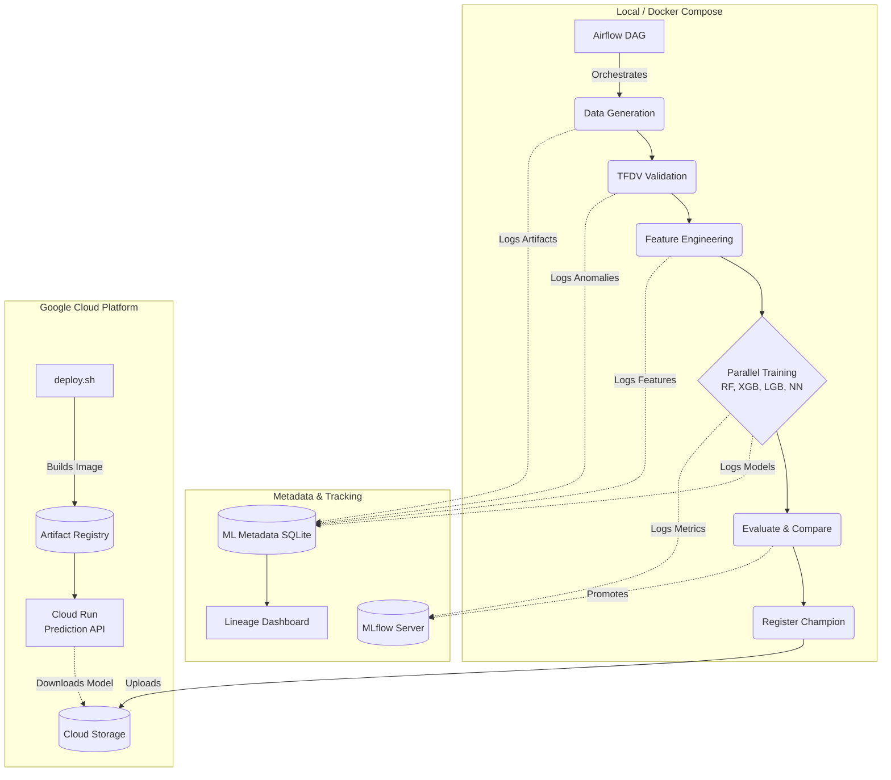

# Lab 5: MLOps Defect Pipeline on GCP (Airflow + MLflow + MLMD + TFDV)


## Overview

This project builds upon Lab 4 by extending the CNC manufacturing defect detection pipeline into a production-grade MLOps system on **Google Cloud Platform (GCP)**. Key additions include:

1. **TensorFlow Data Validation (TFDV)** for automated data profiling, schema generation, and anomaly detection.
2. **ML Metadata (MLMD)** for full artifact and execution lineage tracking across the pipeline.
3. **Advanced Hyperparameter Tuning** using `GridSearchCV` across robust parameter grids for all models.
4. **GCP Deployment** using Cloud Storage (GCS) for artifacts, Artifact Registry for Docker images, and Cloud Run for serverless model serving (staying under the free tier budget of $5).
5. **Interactive Lineage Dashboard** to visualize the complete lifecycle of ML artifacts and executions.

## Architecture



## Quick Start (Local Pipeline)

1. **Start the environment**:
   ```bash
   cd "Lab 5"
   docker compose up --build -d
   ```
2. **Access URLs**:
   - **Airflow**: http://localhost:8080 (airflow / airflow)
   - **MLflow**: http://localhost:5001
   - **Lineage Dashboard**: http://localhost:5003
3. **Trigger Pipeline**:
   - In Airflow UI, find `manufacturing_defect_detection` and trigger the DAG.
4. **View Lineage**:
   - Open the Lineage Dashboard (Port 5003) to see the interactive MLMD graph representing the pipeline execution.

## GCP Deployment (Serverless API)

To deploy the winning model as a serverless API on Cloud Run:

1. **Authenticate with GCP**:
   ```bash
   gcloud auth login
   ```
2. **Run Deploy Script**:
   ```bash
   ./deploy.sh
   ```
   This script will create a GCS bucket, an Artifact Registry repository, build the lightweight `Dockerfile.serve` image, push it, and deploy it to Cloud Run (`min-instances=0` to stay free).

3. **Make Predictions**:
   Use the Cloud Run URL outputted by the script to send POST requests to `/predict`.

4. **Cleanup**:
   To avoid any accidental charges, run:
   ```bash
   ./cleanup.sh
   ```

## Authors
**Ajith Srikanth** - IE7374 MLOps - Northeastern University
