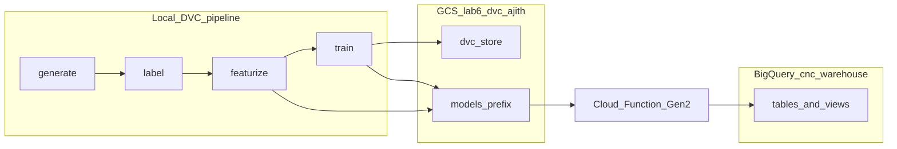

# Lab 6: Cloud Functions + Data Versioning (DVC) + Data Warehouse (BigQuery)


## Overview

This lab combines three MLOps reference areas into one CNC manufacturing defect detection project. You get a **serverless prediction API** on Cloud Functions (Gen 2), **data and model versioning** with DVC backed by **Google Cloud Storage**, and a **BigQuery warehouse** with typed tables, analytical views, and quality reports. The domain, six sensor features, and three quality classes match Labs 3, 4, and 5.

**GCP project:** `ajithmlopsie7374`, **region:** `us-central1`. Stay within the course budget (under about $5) by using free tier limits, small instance counts, and `cleanup.sh` when finished.

## Reference lab mapping

| Reference lab | Coverage in this lab |
|---------------|----------------------|
| CloudFunction_Labs | Gen 2 HTTP function, model and scaler loaded from GCS at cold start, JSON API |
| Data_Labs (DVC) | `dvc.yaml` pipeline, GCS remote, `dvc repro`, `dvc push`, Git tags |
| Data_Labs (labeling) | Rule-based labels, confidence scores, labeler metadata on labeled data |
| Data_Storage_Warehouse_Labs | BigQuery dataset `cnc_warehouse`, four tables, three SQL views, quality loads |

## Architecture



Pipeline stages write CSV and model artifacts locally. DVC tracks outputs and pushes to `gs://lab6-dvc-ajith/dvc-store`. Training produces `champion_model.pkl`, `feature_scaler.pkl` (same scaling as in `featurize`), and metadata. `deploy_function.sh` uploads those objects under `gs://lab6-dvc-ajith/models/`. The function applies `engineer_features_from_raw()` from shared [`src/utils.py`](src/utils.py) (synced into [`cloud_function/utils.py`](cloud_function/utils.py) on deploy), then the fitted scaler, then the RandomForest. Predictions can be appended to `prediction_log` in BigQuery.

## Prerequisites

- Python 3.11, `gcloud` CLI, `gsutil`, `bq`, authenticated to GCP
- `pip install -r requirements.txt` from this directory
- **Git:** Step 5 of `run_pipeline.sh` runs `git add`, `commit`, and `tag` only if this folder is a Git repo. Run `git init` here first if you want those steps to run (see [DVC workflow](#dvc-workflow)).

## Quick start (`run_pipeline.sh`, eight steps)

From the `Lab 6` directory:

1. **DVC + GCS remote:** `dvc_setup.sh` creates the bucket if needed, `dvc init --no-scm`, and sets the default remote to `gs://lab6-dvc-ajith/dvc-store`.
2. **BigQuery dataset:** `setup_warehouse.sh` ensures `ajithmlopsie7374:cnc_warehouse` exists (US).
3. **DVC pipeline:** `dvc repro` runs generate → label → featurize → train.
4. **Push artifacts:** `dvc push` uploads versioned data and models to the GCS remote.
5. **Git tag (optional):** If Git is initialized, commits lockfile and metrics and creates tag `v1.0-lab6` when possible.
6. **Warehouse load:** `python -m src.warehouse_loader` creates tables, loads CSVs, builds views.
7. **Data quality:** `python -m src.data_quality` runs checks and tries to load a report into `data_quality_report`.
8. **Deploy function:** `deploy_function.sh` syncs `src/utils.py` into `cloud_function/`, uploads model artifacts, deploys Gen 2 function `cnc-defect-predictor`.

One command:

```bash
cd "Lab 6"
pip install -r requirements.txt
./run_pipeline.sh
```

## DVC workflow

| Command | Purpose |
|---------|---------|
| `dvc init --no-scm` | Initialize DVC without Git (used in `dvc_setup.sh`) |
| `dvc remote add -d gcs-remote gs://lab6-dvc-ajith/dvc-store` | Default remote (script uses `-f` to reset) |
| `dvc repro` | Rebuild the pipeline per `dvc.yaml` |
| `dvc push` / `dvc pull` | Upload or download cached outputs from GCS |
| `dvc metrics show` | Show metrics from `models/metrics.json` |
| `dvc diff` | Compare workspace to last commit (when using Git + DVC) |

**Version switch example:** after tagging, restore code and data with:

```bash
git checkout v1.0-lab6 && dvc checkout
```

## BigQuery tables and views

**Tables**

| Table | Role |
|-------|------|
| `sensor_readings` | Raw CNC rows: ids, `timestamp`, six sensors, `quality` |
| `defect_labels` | `record_id`, `quality`, `risk_score`, labeler fields |
| `prediction_log` | Inference logs from the Cloud Function |
| `data_quality_report` | Rows from `data_quality.py` checks |

**Views**

- `v_defect_rate_by_machine`: defect rate percent by `machine_id`
- `v_daily_quality_trend`: counts by `production_date` and `quality`
- `v_high_risk_readings`: `defect_labels` with `risk_score > 0.6`

**Example queries** (run in the BigQuery console, project `ajithmlopsie7374`):

```sql
SELECT * FROM `ajithmlopsie7374.cnc_warehouse.v_defect_rate_by_machine` LIMIT 20;
```

```sql
SELECT production_date, quality, count
FROM `ajithmlopsie7374.cnc_warehouse.v_daily_quality_trend`
ORDER BY production_date DESC
LIMIT 30;
```

```sql
SELECT record_id, risk_score, quality
FROM `ajithmlopsie7374.cnc_warehouse.v_high_risk_readings`
LIMIT 50;
```

## Cloud Function endpoints

Replace `URL` with the HTTPS URL from `gcloud functions describe cnc-defect-predictor --region=us-central1 --gen2`.

**Health**

```bash
curl "${URL}?action=health"
```

**Model metadata**

```bash
curl "${URL}?action=model-info"
```

**Single prediction**

```bash
curl -X POST "${URL}" -H "Content-Type: application/json" \
  -d '{"action":"predict","readings":[{"spindle_speed":2500,"feed_rate":200,"depth_of_cut":2.0,"vibration":6.5,"temperature":290,"tool_wear":0.45}]}'
```

**Batch prediction** (`batch-predict` uses the same `readings` array with multiple objects)

```bash
curl -X POST "${URL}" -H "Content-Type: application/json" \
  -d '{"action":"batch-predict","readings":[{"spindle_speed":2500,"feed_rate":200,"depth_of_cut":2.0,"vibration":6.5,"temperature":290,"tool_wear":0.45},{"spindle_speed":3000,"feed_rate":150,"depth_of_cut":1.0,"vibration":2.0,"temperature":220,"tool_wear":0.1}]}'
```

## GCP cost breakdown (typical free tier framing)

| Item | Estimated cost |
|------|----------------|
| Cloud Storage (small DVC store + model blobs) | $0.00 within free tier |
| BigQuery loads and on-demand queries (light use) | $0.00 within free tier |
| Cloud Functions Gen 2 (low traffic, min instances 0) | $0.00 within free tier |
| **Total (lab-style usage)** | **$0.00** if you stay within quotas |

Always confirm in [Google Cloud console billing](https://console.cloud.google.com/billing) for your project.

## Cleanup

```bash
./cleanup.sh
```

Removes the Lab 6 function, dataset `cnc_warehouse`, and bucket `gs://lab6-dvc-ajith` where permissions allow.

## Authors

**Ajith Srikanth**, IE7374 MLOps, Northeastern University
